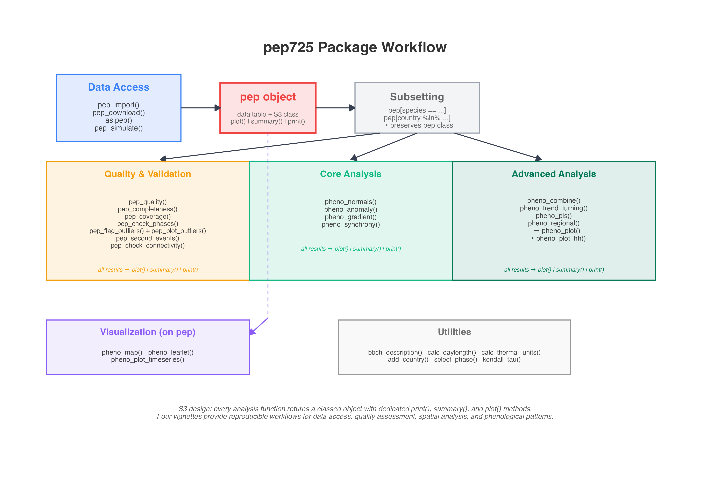
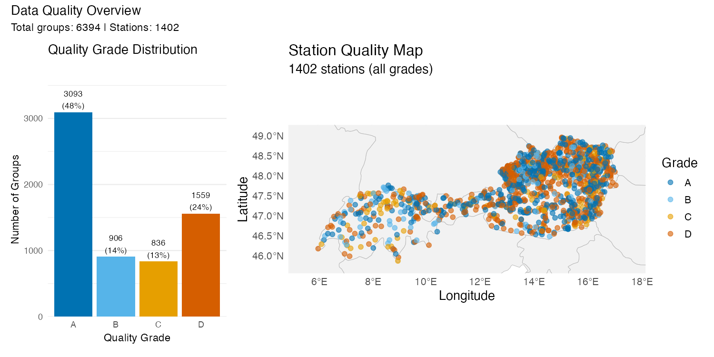

{ width=20% }

# Summary

Phenological observations are a key source of evidence for biological responses to climate variability and change [@parmesan2006ecological; @thackeray2016phenological; @piao2019phenology]. The Pan European Phenology database [PEP725; @templ2018pep725; @templ2026pep725] is an open-access infrastructure for plant phenology data, unifying more than 13 million observations from over 30 countries, spanning the period from 1868 to the present and covering approximately 265 plant species and 46 phenophases. While these datasets offer exceptional scientific value, their analysis is challenged by uneven spatial coverage, heterogeneous data quality and temporal gaps.
The **pep725** R package provides a coherent framework for the spatio-temporal analysis of phenological data from PEP725 and similar ground-based datasets. It supports standardized data import, systematic data quality diagnostics, computation of phenological normals and anomalies, estimation of spatial gradients, quantification of synchrony, climate–phenology sensitivity analysis, and both interactive and publication-ready visualization. In addition the package includes synthetic data generation tools to facilitate reproducible examples and teaching.
Together, these components establish `pep725` as a specialzed framework for quality diagnostic, spatio-temporal structure analyses, and visualization of ground-based phenological data.

# Statement of need

Ground-based phenological datasets pose distinct analytical challenges: observation density varies across regions, long-term records are often incomplete, and data quality differs among contributors and time periods. Without explicit diagnostics and spatial characterization, such heterogeneity can bias spatial comparisons, trend analyses, and downstream model calibration. 

While existing R packages primarily focus on process-based modeling, statistical estimation, or remote-sensing phenology, fewer tools address the diagnostic and spatio-temporal characterization of heterogeneous station-based datasets prior to modeling. 

The **pep725** package addresses these needs by providing a dedicated framework (see Fig 1.) for characterizing station-based phenological datasets prior to modeling, separating data diagnostics from downstream inference to enable more robust and reproducible analyses.


# State of the field

Phenological analysis in R is supported by a diverse ecosystem of packages that address complementary aspects of data modeling, prediction, and interpretation. Many tools focus on process-based or climate-driven modeling of phenological events. For example, `chillR` [@luedeling2012chillr] provides a comprehensive framework for modeling chilling and forcing requirements in temperate fruit trees, including bloom prediction and climate scenario analysis. `DyMEP` [@tschurr2025dymep] implements dynamic, weather-driven phenology models for major crops, offering mechanistic prediction across environments. A general framework for phenology modeling and forecasting is provided by `phenor` [@hufkens2018phenor], which integrates ground-based observations, remote-sensing products, and climate data to support predictive and process-based applications. Crop-specific modeling approaches are further addressed by `phenolocrop` [@taniguchi2025phenolocrop], which focuses on growth stage transitions and machine-learning-based prediction.

Other packages emphasize statistical estimation of seasonal timing from irregular or sparse data. `phenesse` [@belitz2025phenesse] applies quantile regression to estimate onset and end dates of phenophases, enabling robust inference from opportunistic observations. The `phenology` package [@girondot2010phenology] provides parametric and Bayesian models for fitting seasonal distributions of biological events. Auxiliary tools such as `pheno` [@schaber2026pheno] and `spphpr` [@shi2017spphpr] support thermal-time-based phenological calculations and preprocessing workflows.

A parallel line of development targets remote-sensing-based phenology, 
where land surface phenology metrics are derived from vegetation index time 
series rather than ground observations. 
Packages such as `npphen` [@chavez2023npphen] and 
`phenex` [@lange2017phenex] provide tools for detecting vegetation anomalies and 
analyzing spatial patterns in satellite-derived phenology. 
The `sephora` package [@gomez2024sephora] estimates phenological transition 
dates from nearly periodic Earth Observation time series. 
In addition, `phenomap` [@zhang2020phenomap] 
supports spatial interpolation and mapping of phenological observations.

Together, these tools provide extensive support for modeling, estimation, and remote-sensing analysis of phenology. However, their primary focus lies on prediction, parameter estimation, or satellite-derived metrics rather than on the systematic diagnostic and spatial characterization of heterogeneous ground-based observation networks.


# Software design

The design of **pep725** is guided by three principles: (i) explicit treatment of data quality and uncertainty, (ii) transparent and reproducible spatio-temporal analysis workflows, and (iii) modular integration with the broader R ecosystem. 
The package is built around an S3 class, `pep`, implemented as an extended `data.table` with validated spatial and temporal attributes (Fig 1.)

Data enter the workflow through `pep_import()`, `pep_download()`, `as.pep()`, `simulate_pep())`, which create a unified `pep` object. Standard bracket notation (pep[...]) enables class-preserving subsetting by species, region, phase, or time period.

The workflow separates quality and validation (e.g. completeness checks, coverage summaries, outlier detection) from analytical procedures to ensure transparent intermediate diagnostics. 
Analytical functionality is organized into core (e.g. normalization, anomalies, gradients, synchrony) and advanced layers (e.g. trend modelling, combined metrics), with optional robust estimators to reduce sensitivity to outliers and uneven sampling.

The package follows a consistent prefix-based naming convention. 
Functions operating directly on `pep` objects use the `pep_` prefix, 
whereas more general phenological analysis and modelling routines use the 
`pheno_` prefix.

A visualization layer provides maps and time-series plots directly from pep or result objects, while consistent S3 print(), summary(), and plot() methods support reproducible reporting.
{ width=95% }

Fig 1. pep725 package workflow and main functional components.

# Example usage

The example below demonstrates a typical quality-first workflow.

```r
library(pep725)
pep <- pep_download()

# Alpine apple flowering
apple <- pep[species == "Malus domestica" &
             country %in% c("Switzerland", "Austria")]

# Grade each station's record quality (A-D)
quality <- pep_quality(apple, by = c("s_id", "phase_id"))
summary(quality)
plot(quality, which = "overview", pep = apple)  # cf. Fig. 1
```


Another example provide an overview about the data quality for apple flowering stations in Austria and Switzerland.


{ width=95% }

Fig 2. Left: distribution of quality grades (A = best, D = poorest) across 6,394 station-phase combinations. Right: geographic distribution of 1,402 stations colored by quality grade.


# Research impact statement

The **pep725** package has been developed in close connection with the PEP725 database, which has contributed to more than 115 peer-reviewed publications, including 17 in *Nature* and 2 in *Science* [@templ2026pep725]. These studies address phenological questions that the package's analytical functions directly support: climate sensitivity analyses such as @fu2015declining, who demonstrated declining warming effects on spring leaf unfolding at 1,245 PEP725 sites across Europe; and pan-European trend detection as in @menzel2020climate, who identified attributable climate change fingerprints in 97,000 PEP725 time series spanning 1951--2018.

By implementing the methods described in @templ2026pep725 as reproducible R workflows with explicit quality diagnostics, **pep725** lowers the barrier to conducting such analyses on large phenological observation networks. Four vignettes support both research applications and teaching in phenology and environmental data analysis.


# AI usage disclosure

AI-based tools were used as an editorial aid for language polishing and structural improvements in parts of the documentation. All scientific concepts, methodological design, software architecture, implementation, and validation were conceived, developed, and verified by the authors.


# Acknowledgements

We acknowledge the national phenological services and numerous observers contributing to the PEP725 database. We also thank members of the phenology and climate-impact research community for feedback during the development of this package. Dr. Barbara Templ was supported by the Berner Nachwuchsförderung (BNF) program of the University of Bern for developing the **pep725** R package. We thank Dr. Pierlugi Calanca at Agroscope (Switzerland) for his inspirations and Dr. Yann Vitasse for hosting and supporting this work at the Swiss Federal Institute for Forest, Snow and Landscape Research (WSL), which provided an excellent research environment for conducting parts of the development and analysis.

# References
